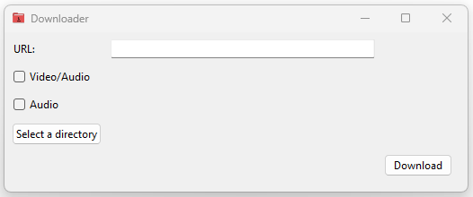

# klowder
My primitive, work in progress, downloader...

It's currently written in python with tkinter.
This may change in the future.

## Current Features

1. Download Video and Audio from [YouTube](https://www.youtube.com)
    - Paste (Ctrl-V) the URL to YouTube video in the entry box
    - Choose your download options
    - Select your preferred download directory

## Future Features
1. Display Thumbnail with option to download it.
2. Drop Downs for video and audio format picker.
3. More to come...